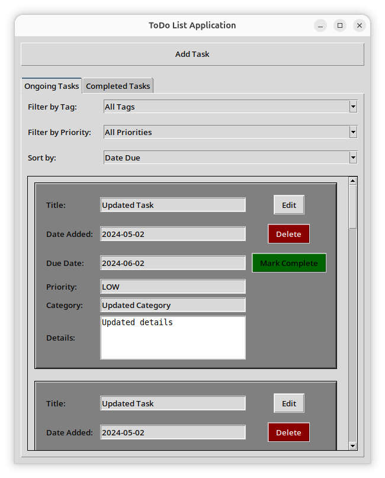
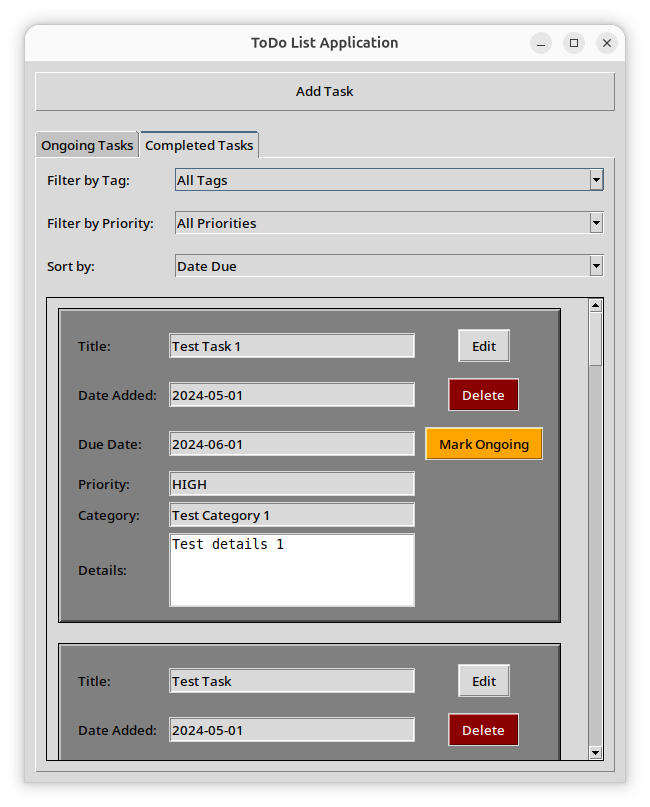
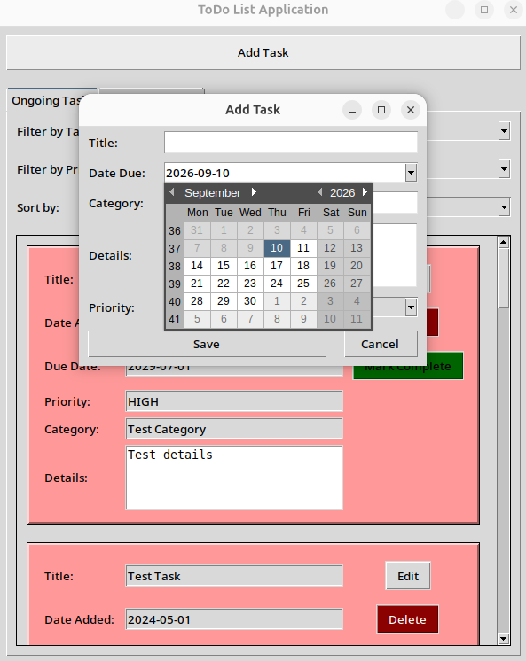
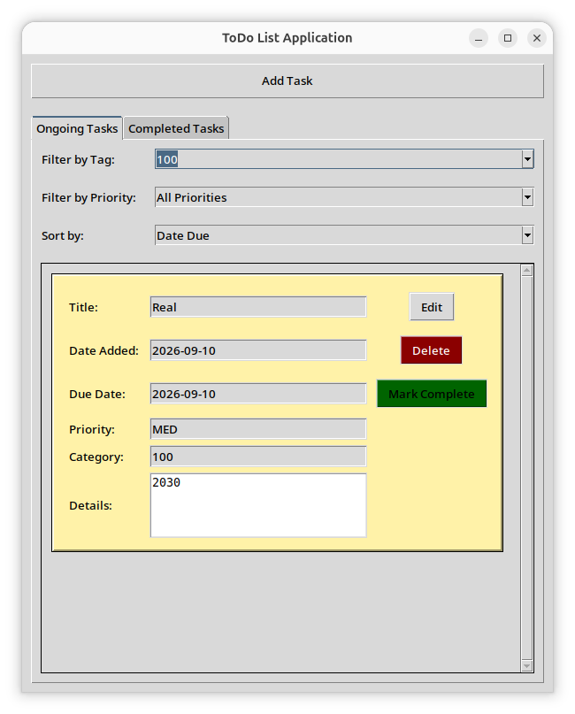

**Which tech stack/backend/database you chose and why?**

The original plan was to use the C++, Qt, and SQLite tech stack for this project.
However, due to time constraints, I decided to pivot to using Python, Tkinter, and SQLite instead.

While not the best in UI/UX, the tech stack allows for rapid development due to its great writability. 

**Python** excels with its huge amount of available libraries for use to integrate features in the code. 

**SQLite** is an easy way to store data in a local database and is able to integrate SQL statements in the Python code.

**Tkinter** while not the most appealing GUI library, and is hard to write due to it being verbose, serves its purpose in developing a user interface.

Overall, the tech stack is excellent in developing simple applications, like a to-do app.

**How to run the app locally (setup steps, dependencies, commands)**

To run locally, execute the following commands in the terminal:
```bash
# clone the repository
git clone

# change directory to the project folder
cd cmsc128-lab1_CRUD_Medalla

# create a virtual environment

# for linux 
python3 -m venv .venv

# for windows
python -m venv .venv

# activate the virtual environment
# for linux
source .venv/bin/activate

# for windows
.venv\Scripts\activate

# install dependencies
# install pip if not installed
# for linux
python3 -m ensurepip --upgrade

# for windows
python -m ensurepip --upgrade

# if installed
python -m pip install --upgrade pip

# then run the following command to install dependencies
pip install -r requirements.txt

# run the app
# for linux
python3 main.py

# for windows
python main.py
```

**Example "API endpoints" or data operations (however your stack exposes CRUD — REST routes, Firestore calls, local DB queries, etc.)**
CRUD operations are done through the `SQLiteConn` class in `api/sqlite3_api.py`. The following methods are available for use:

- open() - Used to open the database connection. Automatically creates the database file if it does not exist.
- close() - Used to close the database connection.
- execute(query, params=None) - Used to execute a SQL query as string with optional parameters.
- add_entry(title, dateAdded, dateDue, priority, category, details, completion=False) - Used to add a new task entry to the database. Returns the id that the database assigned the entry
- remove_entry(taskID) - Used to remove a task entry from the database by its id.
- update_entry(taskID, title=None, dateAdded=None, dateDue=None, priority=None, category=None, details=None, completion=None) - Used to update a task entry in the database by its id.
- fetch_all_entries() - Used to fetch all task entries from the database. Returns a list of Task objects. or None if there are no entries in the database.
- fetch_entry_by_id(taskID) - Used to fetch a task entry from the database by its id. Returns a Task object or None if the entry does not exist.
- toggle_entry_completion(taskID) - Used to toggle the completion status of a task entry in the database by its id.

**Screenshots of the working app**













